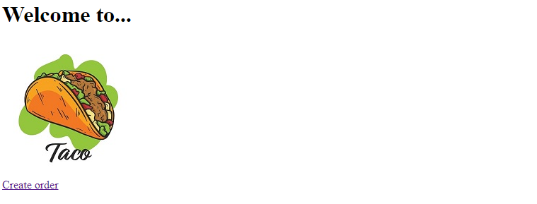
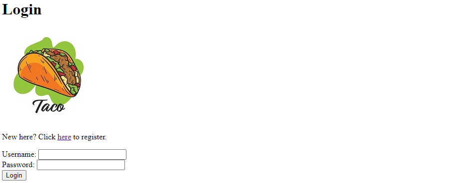
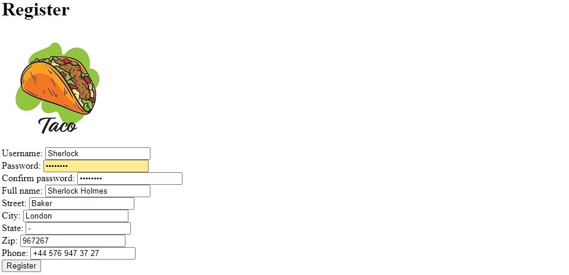
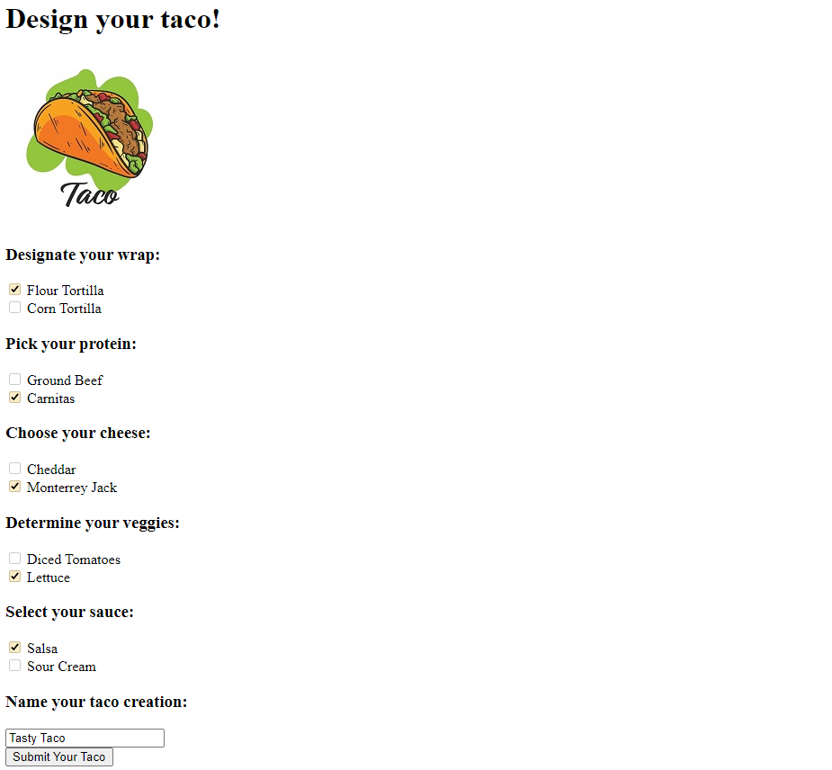
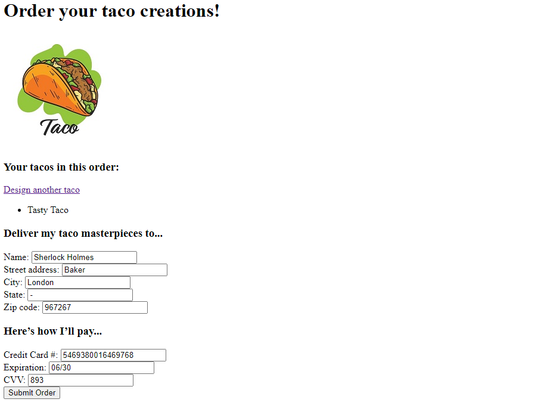
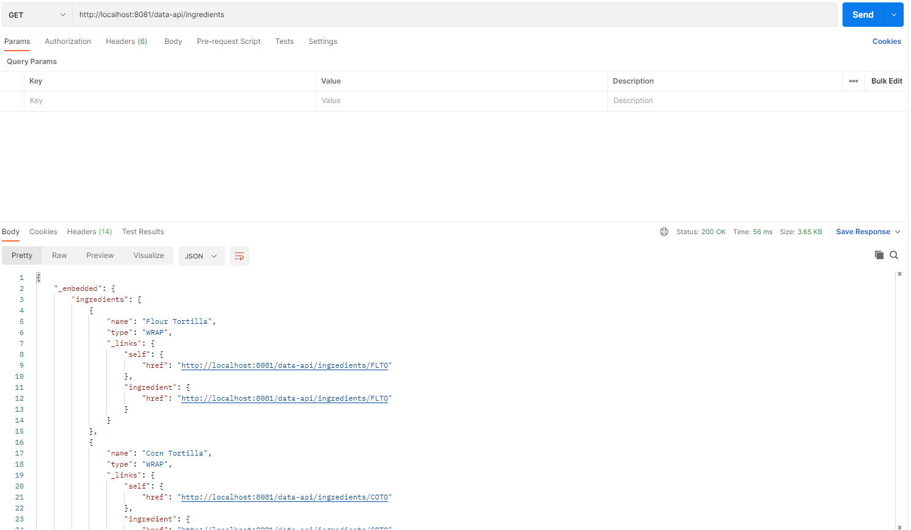

# Taco Cloud

Тренировочный проект для обкатки Spring Framework по книге Крейга Уоллса "Spring в действии".

## Описание сервиса
Сервис представляет собой сайт для заказа тако. 
Сервис позволяет:
* зарегистрировать учетную запись
* собирать свой собственный тако из доступных ингредиентов 
* оформить доставку по указанному адресу

## Стек технологий
* Java 17
* H2 2.1.214
* Apache Maven 3.8.5
* Spring Boot 2.7.9
* Thymeleaf 3.0.15
* Slf4j 1.7.36
* Lombok 1.18.26
* Checkstyle 10.7.0

## Требуемое окружение для запуска проекта
* Браузер
* JDK 17
* Apache Maven 3.8

## Инструкция по запуску проекта
1) Скачать и разархивировать проект
2) Открыть командную строку и перейти в папку с проектом, например `cd c:\projects\taco-cloud`
3) Выполнить команду `mvn install`
4) Перейти в папку target командой `cd target`
5) Выполнить команду `java -jar taco-cloud-0.0.1-SNAPSHOT.jar`

## Взаимодействие с приложением посредством браузера
### При открытии сайта попадаем на главную страницу

### При попытке создать заказ, если авторизации не было, попадаем на страницу с формой для ввода логина и пароля

### Если учетной записи ещё нет, то необходимо пройти регистрацию

### Далее собираем тако из перечня доступных ингредиентов

### И попадаем на форму с оформлением заказа и доставки

### При подтверждении заказа он отправляется на обработку, и происходит редирект на главную страницу

## Взаимодействие с приложением посредством REST API
### Через обращение к сервису по адресу */data-api можно увидеть имеющиеся конечные точки Spring Data REST

### Например, можно получить список ингредиентов, отправив запрос на указанный на скриншоте адрес

## Контакты для связи
&nbsp;&nbsp;
&nbsp;&nbsp;